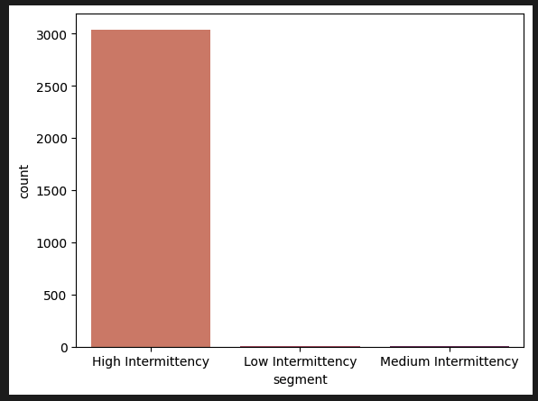
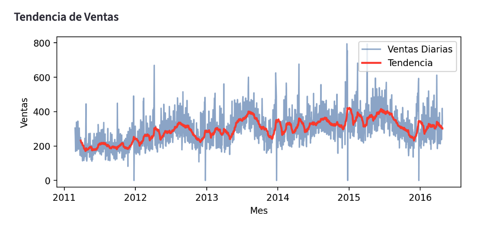
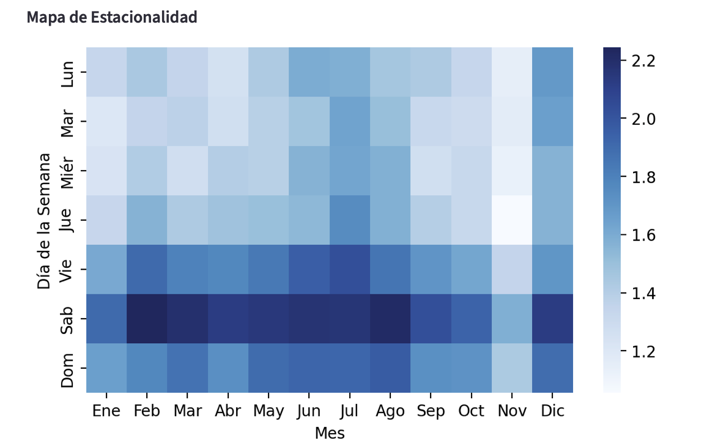
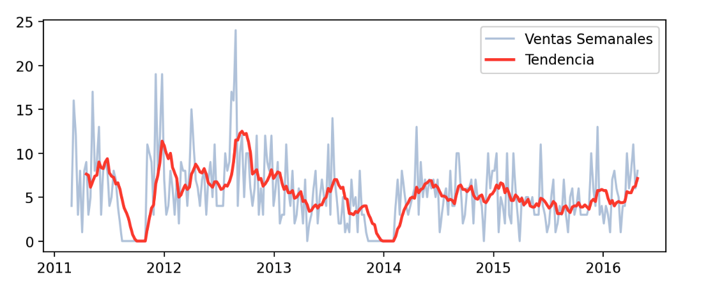
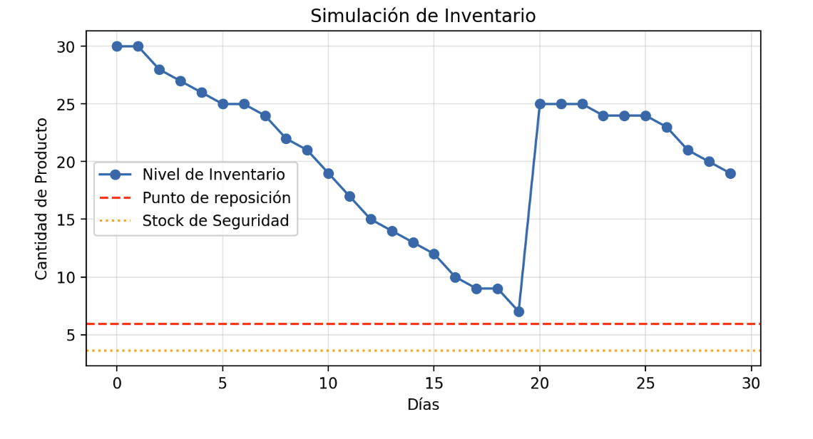
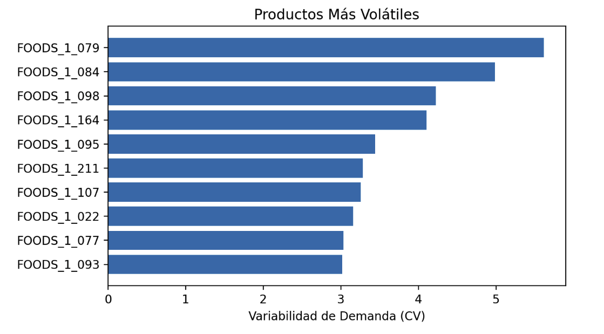

# Forecasting de Demanda Retail y Optimización de inventario 

## Descripción
Este proyecto analiza datos de ventas retail para predecir la demanda de productos y simular políticas de inventario.

El objetivo es ayudar a los retailers a:
* Anticipar la demanda
* Reducir roturas de stock
* Optimizar niveles de inventario 

El proyecto integra:
* Análisis exploratorio de datos
* Ingeniería de variables para series temporales
* Modelos de Machine Learning para forecasting
* Simulación de inventario
* Dashboard interactivo con Streamlit

## Descripción del Problema

La demanda en retail suele presentar:
* Alta intermitencia (muchos días sin ventas)
* Variabilidad entre productos
* Estacionalidad semanal

Esto dificulta la planificación de inventario.

Este proyecto busca responder tres preguntas clave:
1. ¿Podemos predecir la demanda futura de productos?
2. ¿Qué productos presentan mayor volatilidad?
3. ¿Cómo podemos definir políticas de inventario óptimas?

## Tabla de Contenidos
- [Descripción](#descripción)
- [Descripción del Problema](#descripción-del-problema)
- [Instalación](#instalación)
- [Uso](#uso)
- [Dataset](#dataset)
- [Variables Principales](#variables-principales)
- [Preguntas de Investigación](#preguntas-de-investigación)
- [Ingeniería de Variables](#ingeniería-de-variables)
- [Predicción de Demanda](#prediccion-de-demanda)
- [Modelos de Forecasting](#modelos-de-forecasting)
- [Simulación de Inventario](#simulación-de-inventario)
- [Identificación de Productos Críticos](#identificación-de-productos-críticos)
- [Dashboard Interactivo](#dashboard-interactivo)
- [Tecnologías Utilizadas](#tecnologías-utilizadas)
- [Conclusiones](#conclusiones)
- [Contribución](#contribución)

## Instalación
1. Clonar el repositorio:
   git clone https://github.com/MonicaFernandezM/M5_forecasting

2. Abrir el proyecto en Jupyter Notebook.

3. Ejecutar el notebook principal para reproducir el análisis.

No es necesario instalar dependencias adicionales si ya se cuenta con un etorno estándar de análisis de datos en Python. 

## Uso 
* Abrir el notebook del proyecto.
* Ejecutar las celdas en orden.
* Explorar los resultados.

El análisis está organizado por secciones para facilitar la comprensión del flujo de trabajo.

## Dataset

Los datos provienen del dataset [M5 Forecasting](https://www.kaggle.com/datasets/aryayadav0513/m5-forecasting-accuracy) (ventas de Walmart).

Incluye:
* Ventas diarias por producto
* Información de tiendas
* Categorías y departamentos
* Eventos del calendario
* Precios de venta

Para facilitar el análisis se utilizó un prototipo con la tienda CA_1.

## Variables Principales

| Variable | Descripción |
|----------|-------------|
| date | fecha de la venta |
| sales | unidades vendidas |
| sell_price | precio del producto |
| item_id | identificador del producto |
| store_id | tienda|
| cat_id | categoría |
| dept_id | departamento |

## Preguntas de Investigación
* ¿Existen patrones de estacionalidad en las ventas?
* ¿Cómo afecta el precio a la demanda de los productos?
* ¿Qué productos presentan mayor variabilidad en la demanda?
* Se observa un aumento de ventas durante el fin de semana?
* ¿Qué productos presentan mayor riesgo de rotura de stock?
* Es posible predecir la demanda futura utilizando modelos de Machine Learning?

El análisis inicial permitió identificar varios patrones importantes.

- Demanda Intermitente:
Una gran proporción de observaciones presenta ventas iguales a cero, lo que indica demanda irregular.

- Tendencia de Ventas:
Se analiza la evolución de las ventas diarias a lo largo de cinco años.

- Estacionalidad Semanal:
¿Se observa un aumento de ventas durante el fin de semana?

Se observa un incremento consistente en las ventas durante el fin de semana, con un aumento aproximado del 41,7% respecto a los días laborales. Este patrón sugiere que la planificación de inventario debería considerar un aumento de demanda antes del sábado.

## Ingeniería de Variables
Para capturar patrones temporales se crearon varias variables.

- Variables Lag:
    Valores pasados de ventas utilizados como predictores.
    * lag_7
    * lag_28
    * Rolling Mean

- Promedios móviles que capturan tendencias recientes:
    * rolling_mean_7
    * rolling_mean_28

- Variables Temporales:
    * month
    * year
    * dayofweek
    * is_weekend
    * has_event

Estas variables permiten que el modelo capture estacionalidad y patrones temporales.

## Predicción de demanda
Esta predicción de valores de ventas es para cada producto, donde vemos la predicción para la siguiente semana a la hora de las posibles ventas.

## Modelos de Forecasting
Se evaluaron varios modelos de machine learning:
* Random Forest
* Gradient Boosting
* XGBoost

Las métricas utilizadas fueron:
* RMSE
* MAE

| Modelo | RMSE | MAE |
|-------|------|------|
| Random Forest | Mejor | Mejor |
| Gradient Boosting | Similar | Similar |
| XGBoost | Similar | Similar | 

## Simulación de Inventario
Con la demanda estimada se simula una política de inventario.

* Safety Stock = Z × σ × √Lead Time
* Reorder Point = Demanda × Lead Time + Safety Stock
Esto permite determinar cuándo se debe realizar un pedido de reposición.

## Identificación de Productos Críticos

Para detectar productos con alta incertidumbre se utilizó el coeficiente de variación:

CV = desviación estándar / media

donde: 
| CV | Interpretación |
|----|---------------|
| < 1 | demanda estable |
| 1 – 2 | variabilidad media |
| > 2 | alta volatilidad |

Los productos con mayor CV requieren mayor stock de seguridad.

## Dashboard Interactivo
Se desarrolló un dashboard utilizando Streamlit.

Funcionalidades principales:

Dataset Overview
* Tendencia de ventas
* Productos más vendidos
* Estacionalidad

Demand Forecast
* Evolución de ventas por producto
* Predicción de demanda del día siguiente

Inventory Simulation
* Cálculo de safety stock
* Simulación de inventario
* Evaluación de riesgo de stockout

Critical Products
* Ranking de productos más volátiles
* Identificación de productos críticos

## Tecnologías Utilizadas

El proyecto fue desarrollado utilizando Python y las siguientes librerías:
* pandas
* numpy
* scikit-learn
* xgboost
* matplotlib
* seaborn
* plotly
* streamlit
* joblib

## Conclusiones

El análisis muestra que:
* La demanda en retail presenta alta intermitencia.
* Existe estacionalidad semanal clara.
* Algunos productos presentan alta volatilidad.
* El modelo reduce el error de predicción aproximadamente 25% respecto al baseline.

La combinación de forecasting + simulación de inventario permite mejorar la planificación de stock.

## Contribución

Las contribuciones son bienvenidas.

Si deseas mejorar el análisis o añadir nuevas visualizaciones:
1. Haz un fork del repositorio
2. Crea una nueva rama
3. Realiza tus cambios
4. Abre un Pull Request

## Autor

Mónica María Fernández Mirás